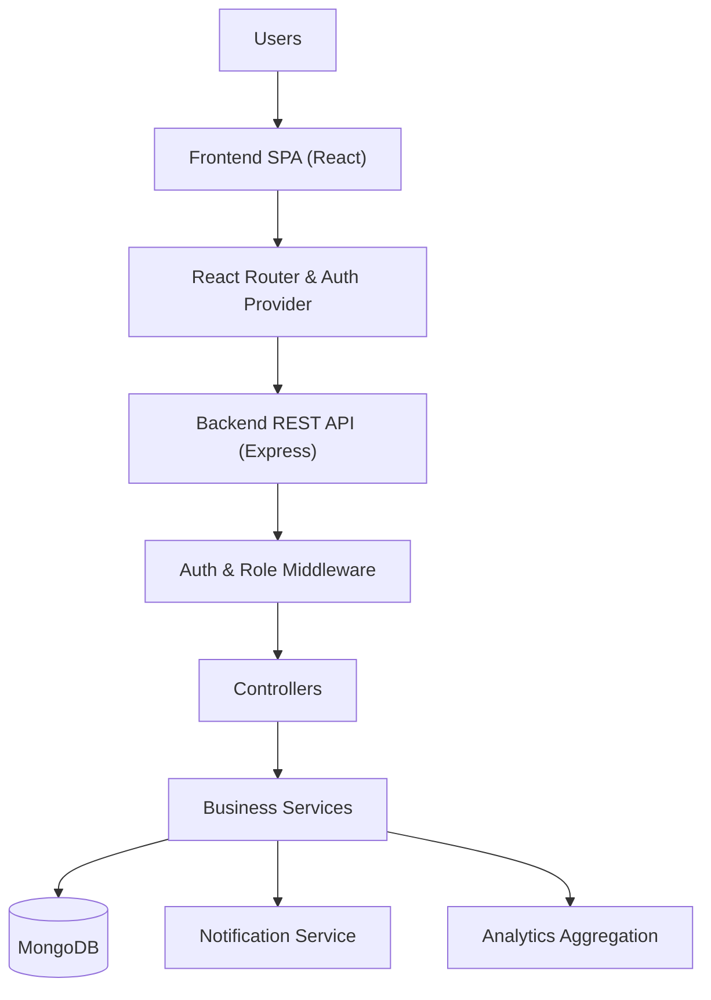
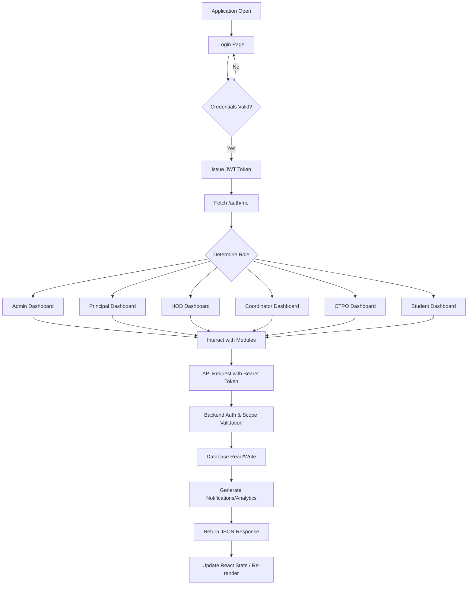
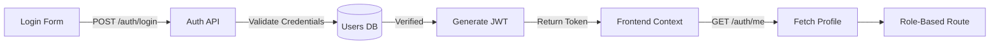
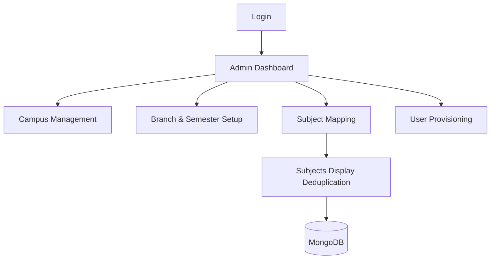
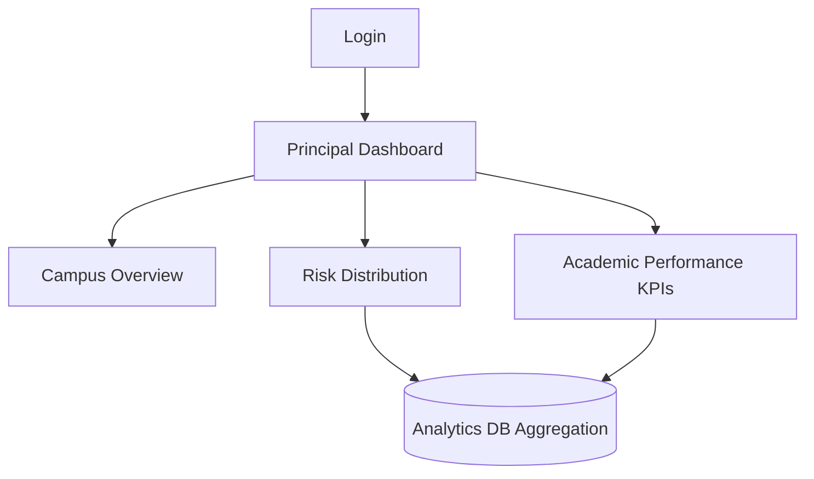
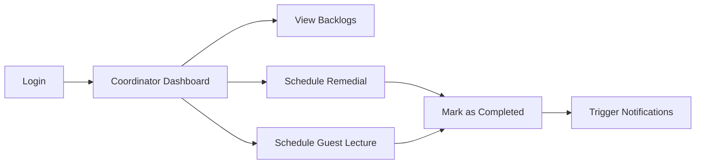
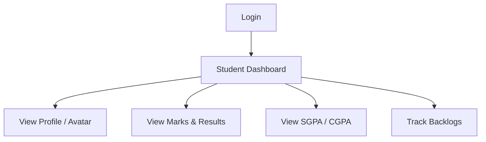
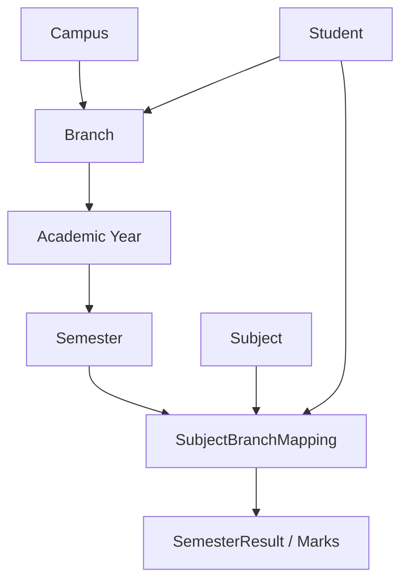
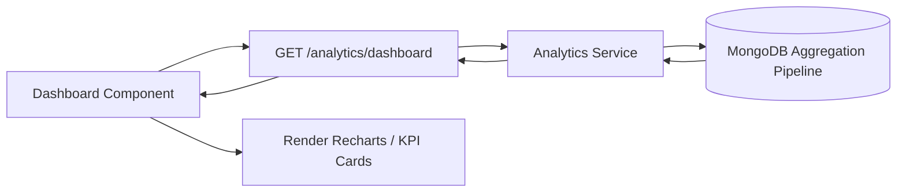
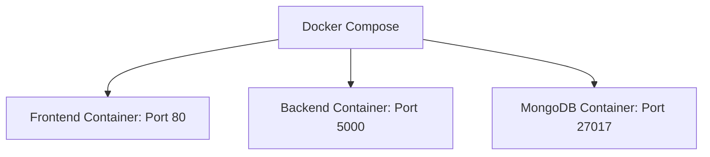

# Academic Engagement, Student Risk & Academic Support Management System

An end-to-end full-stack platform designed for higher education institutions to manage academic master data, track student performance, identify at-risk students, and facilitate academic support such as remedial classes and guest lectures.

The system replaces fragmented spreadsheets with a centralized database, offering role-based dashboards that provide tailored insights to Administrators, Principals, HODs, Coordinators, CTPOs, Faculty, and Students. It solves the critical problem of tracking academic progression across multiple branches and semesters, empowering faculty and management to intervene early for struggling students while ensuring seamless academic operations.

---

## Table of Contents
1. [Overview](#overview)
2. [Key Features](#key-features)
3. [Technology Stack](#technology-stack)
4. [System Architecture](#system-architecture)
5. [Overall Workflow](#overall-workflow)
6. [Authentication](#authentication)
7. [Roles & Permissions](#roles--permissions)
8. [Role Workflows](#role-workflows)
9. [Academic Data Flow](#academic-data-flow)
10. [Core Modules](#core-modules)
11. [Dashboards & Analytics](#dashboards--analytics)
12. [API Architecture](#api-architecture)
13. [Database Architecture](#database-architecture)
14. [Frontend Architecture](#frontend-architecture)
15. [Backend Architecture](#backend-architecture)
16. [Security](#security)
17. [Project Structure](#project-structure)
18. [Installation & Local Setup](#installation--local-setup)
19. [Docker Deployment](#docker-deployment)
20. [Testing](#testing)
21. [Future Scope](#future-scope)

---

## Overview
The system provides a cohesive environment where administrative staff manage the foundational academic hierarchy (Campuses, Branches, Semesters, Subjects, and mappings). Once established, faculty upload and track marks and results, while students access their academic profiles, SGPA/CGPA standing, and backlog history. Management roles (Principals, HODs) access high-level analytical dashboards to monitor institutional health, while Coordinators and CTPOs arrange remedial classes and guest lectures to support student success.

## Key Features
- **Secure Authentication & RBAC**: JWT-based login with strict role-based access control.
- **Academic Master Management**: Complete CRUD for Campuses, Branches, Academic Years, Semesters, and Subjects.
- **Dynamic Subject Mapping**: Highly flexible Subject-to-Branch-Semester mappings handling diverse academic cohorts seamlessly.
- **Results & Backlogs Tracking**: Robust tracking of historical SGPA/CGPA, current marks, and uncleared backlogs.
- **Academic Support**: End-to-end workflows for scheduling and completing Guest Lectures and Remedial Classes.
- **Real-Time Analytics**: Visual dashboards offering insights into risk distribution, academic performance, and branch metrics.
- **Notifications**: Automated in-app notifications for task assignments and academic updates.
- **Responsive UI**: Built with React, Tailwind CSS, and Radix UI primitives.

---

## Technology Stack

| Layer | Technologies | Purpose |
|------|--------------|---------|
| **Frontend** | React 19, TypeScript, Vite, Tailwind CSS, Radix UI | Fast, accessible, and responsive user interface |
| **Backend** | Node.js, Express.js | High-performance RESTful API server |
| **Database** | MongoDB, Mongoose | Flexible, schema-driven NoSQL data persistence |
| **Charts** | Recharts | Dynamic analytics and data visualization |
| **Authentication** | JWT, bcrypt | Secure stateless sessions and password hashing |
| **Validation** | express-validator | Strong input sanitization and validation |
| **PDF Generation** | jsPDF, html2canvas | Exporting reports and analytics |
| **Testing** | Jest, Supertest | Unit and integration testing |
| **Deployment** | Docker, Docker Compose | Containerized application deployment |

---

## System Architecture



---

## Overall Workflow



---

## Authentication

Authentication is entirely stateless using JSON Web Tokens (JWT).


- **Login**: Users authenticate with email/password. 
- **Token Handling**: JWT is stored securely on the client and attached as a `Bearer` token to the `Authorization` header of all protected requests.
- **Identity Resolution**: `/auth/me` retrieves the user's role and scopes (e.g., `branchId`, `campusId`) to dynamically render navigation and restrict data access.

---

## Roles & Permissions

| Role | Dashboard | Main Modules | Main Actions | Data Scope |
| ---- | --------- | ------------ | ------------ | ---------- |
| **Admin** | Admin Dashboard | Campuses, Branches, Subjects, Users | Master Data CRUD, User Provisioning | Global |
| **Principal** | Principal Dashboard | Overview, Analytics, Campuses | View institutional performance, risk analysis | Campus-wide |
| **HOD** | HOD Dashboard | Analytics, Students, Backlogs | Monitor department performance, assign support | Branch-specific |
| **Coordinator** | Coordinator Dashboard | Remedial, Guest Lectures, Backlogs | Schedule/complete academic support | Branch/Section-specific |
| **CTPO** | CTPO Dashboard | Placements, Student Lists | Monitor eligible students, training modules | Branch-specific |
| **Student** | Student Dashboard | Profile, Results, Backlogs | View grades, attendance, notifications | Self |

---

## Role Workflows

### Admin Workflow
Admins establish the structural foundation of the application.


### Principal Workflow
Principals monitor macro-level institutional health.


### Coordinator Workflow
Coordinators take actionable steps to remediate at-risk students.


### Student Workflow
Students have a read-only view of their progression.


---

## Academic Data Flow

The system relies on a rigorous academic hierarchy.


---

## Core Modules

### Subjects
The `SubjectBranchMapping` model dictates curriculum offerings. The Admin Subjects UI employs robust frontend deduplication to ensure the same logical subject (sharing a normalized name) is displayed only once per `Branch + Year + Semester`, preserving database integrity while hiding cohort-specific duplicate codes (e.g. `R23` vs `NEW-CAI`). Laboratory subjects are intentionally preserved as distinct entries.

### Results / SGPA / CGPA
Results track a student's academic history.
- **SGPA**: Computed based on `Σ(Credit × Grade Point) / Σ(Credit)` for a specific semester.
- **CGPA**: The cumulative equivalent computed across all historical semesters.
- **Grade Points**: Mapped from letter grades (O, A+, A, B, etc.).

### Backlogs
Students failing to clear a subject accumulate a `Backlog`. Backlogs fuel the Risk Distribution analytics. Once a student clears a subject, the backlog is resolved.

### Remedial Classes & Guest Lectures
Academic support modules allowing Coordinators to create events. Both models track status (`SCHEDULED`, `COMPLETED`, `CANCELLED`). Completing an event triggers database updates and broadcasts notifications to relevant faculty and students.

### Notifications
A robust notification engine generates alerts for critical actions (e.g., Guest Lecture completed). Notifications track an `isRead` flag and populate a real-time Topbar dropdown.

---

## Dashboards & Analytics


**Registered Subjects KPI**: Accurately reflects the number of uniquely identifiable subject syllabi mapped within the college (~179), explicitly excluding unmapped orphaned subjects.

---

## API Architecture

| Module | Endpoint Prefix | Purpose | Scope/Auth |
| ------ | --------------- | ------- | ---------- |
| **Auth** | `/api/auth` | Login, /me, role resolution | Public / Authenticated |
| **Master** | `/api/academic-master` | Campuses, Branches, Subjects | Admin |
| **Users** | `/api/users` | User CRUD, Profile updates | Admin / Self |
| **Students** | `/api/students` | Student rosters, details | Principal, HOD, Coord |
| **Analytics**| `/api/analytics` | KPIs, Risk charts, Dashboards | Principal, HOD, Admin |
| **Results** | `/api/results` | Marks, SGPA, CGPA | HOD, Coord, Student |
| **Backlogs** | `/api/backlogs` | Uncleared subject tracking | HOD, Coord, Student |
| **Support** | `/api/guest-lectures`<br>`/api/remedial-classes` | Scheduling, Status updates | Coordinator, Student |
| **Notifs** | `/api/notifications` | Fetch unread, mark read | All Authenticated Users |

---

## Database Architecture

| Model | Purpose | Important Relationships |
| ----- | ------- | ----------------------- |
| **User** | System identities | Base auth identity |
| **Student** | Student specifics | Links to User, Branch, Semester |
| **Campus** | Physical locations | Top-level entity |
| **Branch** | Academic departments | Belongs to Campus |
| **Semester** | Academic terms | Belongs to Year |
| **Subject** | Academic courses | Maps to Semesters/Branches |
| **SubjectBranchMapping** | Curriculum mapping | Joins Subject, Branch, Semester |
| **SemesterResult** | Student term performance| Links Student, Semester |
| **Backlog** | Uncleared subjects | Links Student, Subject |
| **GuestLecture** | Support events | Links Branch, Coordinator |
| **Notification** | Alerts | Links to recipient User |

---

## Frontend Architecture

```text
frontend/
├── src/
│   ├── components/
│   │   ├── common/      (Reusable UI: PageHeader, LoadingSkeleton)
│   │   └── ui/          (Radix/Tailwind components)
│   ├── contexts/        (AuthContext, NavigationContext)
│   ├── layouts/         (DashboardLayout, Topbar, Sidebar)
│   ├── modules/         (Domain logic: admin, student, principal, etc.)
│   ├── services/        (Axios API clients)
│   ├── utils/           (Helpers, PDF generation)
│   ├── App.tsx          (Root component & Providers)
│   └── main.tsx         (Entry point)
```

## Backend Architecture

```text
backend/
├── src/
│   ├── config/          (DB connection, env vars)
│   ├── middleware/      (Auth, Error handling, RBAC)
│   ├── modules/         (Domain logic)
│   │   ├── auth/        (Controllers, Routes, Services)
│   │   ├── academic-master/
│   │   ├── analytics/
│   │   ├── results-backlogs/
│   │   └── notifications/
│   ├── utils/           (Helpers)
│   └── server.js        (Express entry point)
```

---

## Security
- **Authentication**: JWT validation middleware secures all non-public routes.
- **Authorization**: Role-based access control (RBAC) middleware rejects requests exceeding user permissions.
- **Data Scoping**: HOD and Coordinator controllers strictly scope MongoDB queries using `req.user.branchId` to prevent cross-department data leaks.
- **Data Integrity**: Passwords are mathematically hashed using bcrypt before storage.
- **Validation**: Strict input parsing via `express-validator` prevents malformed data injection.

---

## Installation & Local Setup

### Prerequisites
- Node.js (v18+)
- MongoDB (Local or Atlas URL)
- Docker (optional)

### Environment Variables
Create a `.env` file in the `backend/` directory:
```env
PORT=5000
MONGODB_URI=mongodb://localhost:27017/student-academic-system
JWT_SECRET=your_secure_random_string
```
Create a `.env` file in the `frontend/` directory:
```env
VITE_API_URL=http://localhost:5000/api
```

### Backend
```bash
cd backend
npm install
npm run dev
```

### Frontend
```bash
cd frontend
npm install
npm run dev
```

---

## Docker Deployment

The application is container-ready, orchestrating the frontend, backend, and MongoDB via Docker Compose.



To deploy locally:
```bash
docker-compose up --build
```

---

## Testing

The backend implements a testing suite utilizing **Jest** and **Supertest**.
```bash
cd backend
npm run test
```

---

## Future Scope
- Integrating AI-driven early-warning systems based on historical backlog trends.
- Implementing an automated timetable generation engine for Remedial Classes.
- Expanding the Analytics dashboard with predictive graduation trajectory models.
- Support for detailed granular Attendance tracking synced with Guest Lectures.

---
*End of Documentation*
