# KIET AMS — Academic Management System

## Overview
KIET AMS is a comprehensive academic management system designed to streamline institutional workflows, manage student records, track academic progress, and provide role-based dashboards for various stakeholders including the Principal, HODs, CTPO, Coordinators, and Students.

## Key Features
- Role-Based Access Control (RBAC) with specific dashboards for Principal, HOD, CTPO, Coordinator, Student, and Admin.
- Result Import & Processing (PDF/Excel)
- Backlog Tracking & Analytics
- Academic Year Administration
- Attendance & Marks Management
- Notifications System
- PDF/Excel Data Exports

## Technology Stack
- **Frontend**: React, Vite, Tailwind CSS, shadcn/ui
- **Backend**: Node.js, Express, MongoDB
- **Result Processor**: Python (pdfplumber, pandas)

## System Architecture
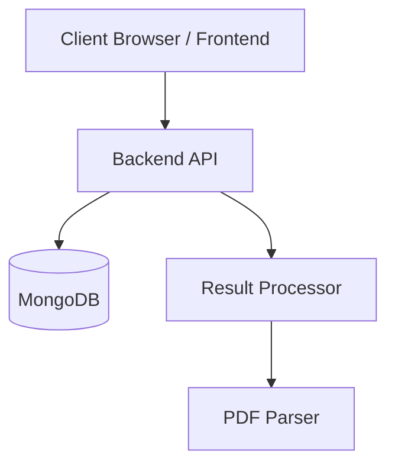
```mermaid
graph TD
    Client[Client Browser / Frontend] --> API[Backend API]
    API --> DB[(MongoDB)]
    API --> Processor[Result Processor]
    Processor --> PDF[PDF Parser]
```

## Project Structure
```text
backend/
  ├── config/
  ├── controllers/
  ├── middlewares/
  ├── models/
  ├── routes/
  ├── services/
  ├── utils/
  └── server.js
frontend/
  ├── src/
  │   ├── assets/
  │   ├── components/
  │   ├── modules/
  │   ├── pages/
  │   ├── services/
  │   └── utils/
  ├── package.json
  └── vite.config.js
result-processor/
  ├── pdf_parser.py
  └── requirements.txt
```

## User Roles and Dashboards
- **Admin**: Manages system configurations, academic years, roles, and imports results.
- **Principal**: Oversees campus-wide performance and branch analytics.
- **HOD**: Monitors department-level results and backlogs.
- **CTPO**: Manages marks, student records, and placement readiness.
- **Coordinator**: Tracks attendance, remedial classes, and student interactions.
- **Student**: Views personal marks, results, and backlogs.

## Complete Project Workflow
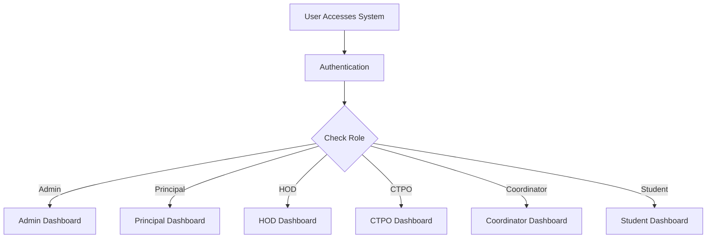
```mermaid
graph TD
    Start[User Accesses System] --> Login[Authentication]
    Login --> RoleCheck{Check Role}
    RoleCheck -->|Admin| AdminDash[Admin Dashboard]
    RoleCheck -->|Principal| PrinDash[Principal Dashboard]
    RoleCheck -->|HOD| HODDash[HOD Dashboard]
    RoleCheck -->|CTPO| CTPODash[CTPO Dashboard]
    RoleCheck -->|Coordinator| CoordDash[Coordinator Dashboard]
    RoleCheck -->|Student| StudDash[Student Dashboard]
```

## Authentication Workflow
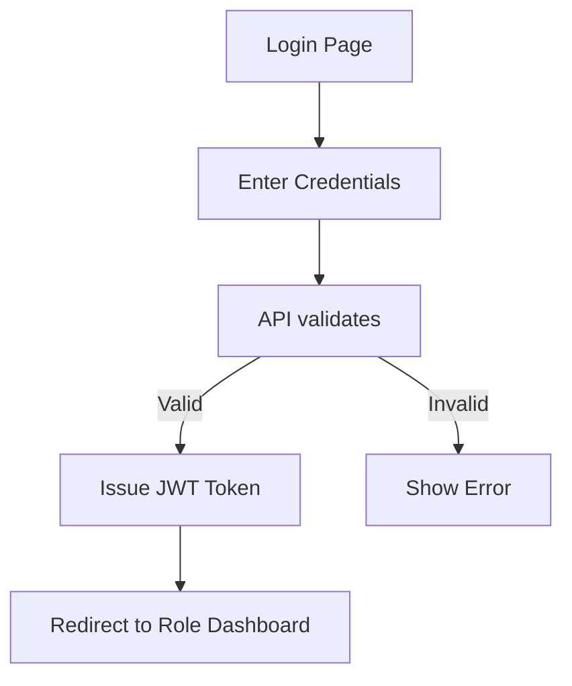
```mermaid
graph TD
    Login[Login Page] --> EnterCreds[Enter Credentials]
    EnterCreds --> API[API validates]
    API -->|Valid| JWT[Issue JWT Token]
    API -->|Invalid| Error[Show Error]
    JWT --> Redir[Redirect to Role Dashboard]
```

## Role-Based Access Workflow
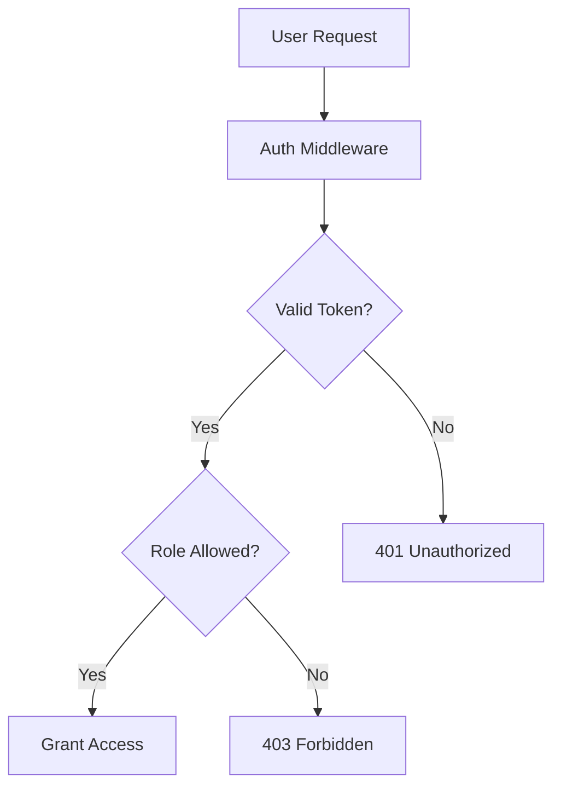
```mermaid
graph TD
    Request[User Request] --> Middleware[Auth Middleware]
    Middleware --> VerifyToken{Valid Token?}
    VerifyToken -->|Yes| CheckRole{Role Allowed?}
    VerifyToken -->|No| Reject[401 Unauthorized]
    CheckRole -->|Yes| Access[Grant Access]
    CheckRole -->|No| Forbidden[403 Forbidden]
```

## Principal Dashboard Workflow
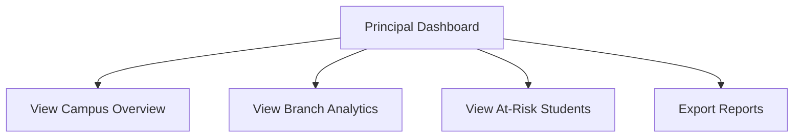
```mermaid
graph TD
    PrinDash[Principal Dashboard] --> Over[View Campus Overview]
    PrinDash --> Branch[View Branch Analytics]
    PrinDash --> Risk[View At-Risk Students]
    PrinDash --> Export[Export Reports]
```

## HOD Workflow
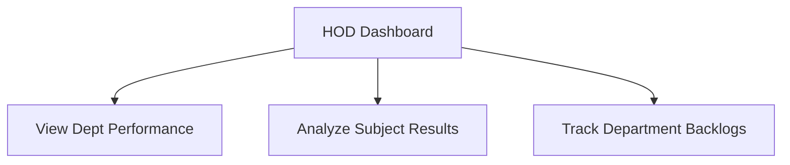
```mermaid
graph TD
    HODDash[HOD Dashboard] --> Perf[View Dept Performance]
    HODDash --> Subj[Analyze Subject Results]
    HODDash --> Backlogs[Track Department Backlogs]
```

## CTPO Workflow
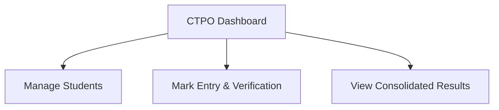
```mermaid
graph TD
    CTPODash[CTPO Dashboard] --> Stud[Manage Students]
    CTPODash --> Marks[Mark Entry & Verification]
    CTPODash --> Results[View Consolidated Results]
```

## Coordinator Workflow
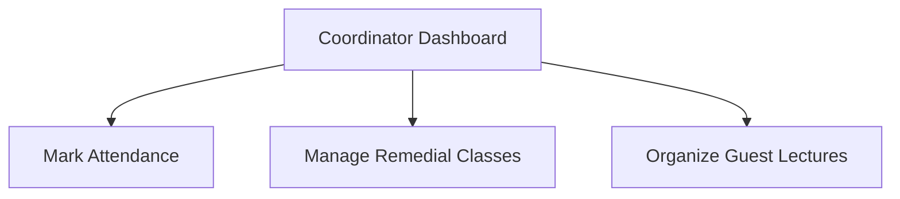
```mermaid
graph TD
    CoordDash[Coordinator Dashboard] --> Att[Mark Attendance]
    CoordDash --> Remedial[Manage Remedial Classes]
    CoordDash --> Guest[Organize Guest Lectures]
```

## Student Workflow

```mermaid
graph TD
    StudDash[Student Dashboard] --> MyMarks[View Marks]
    StudDash --> MyResults[View Results]
    StudDash --> MyBacklogs[View Backlogs]
```

## Result Import Workflow
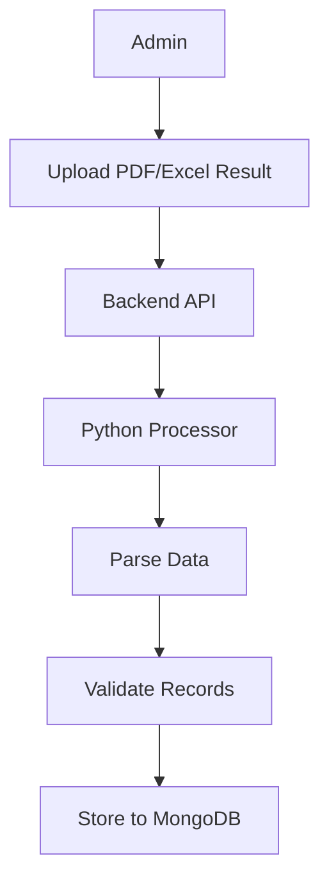
```mermaid
graph TD
    Admin[Admin] --> Upload[Upload PDF/Excel Result]
    Upload --> Node[Backend API]
    Node --> Py[Python Processor]
    Py --> Parse[Parse Data]
    Parse --> Validate[Validate Records]
    Validate --> DB[Store to MongoDB]
```

## Export Workflow
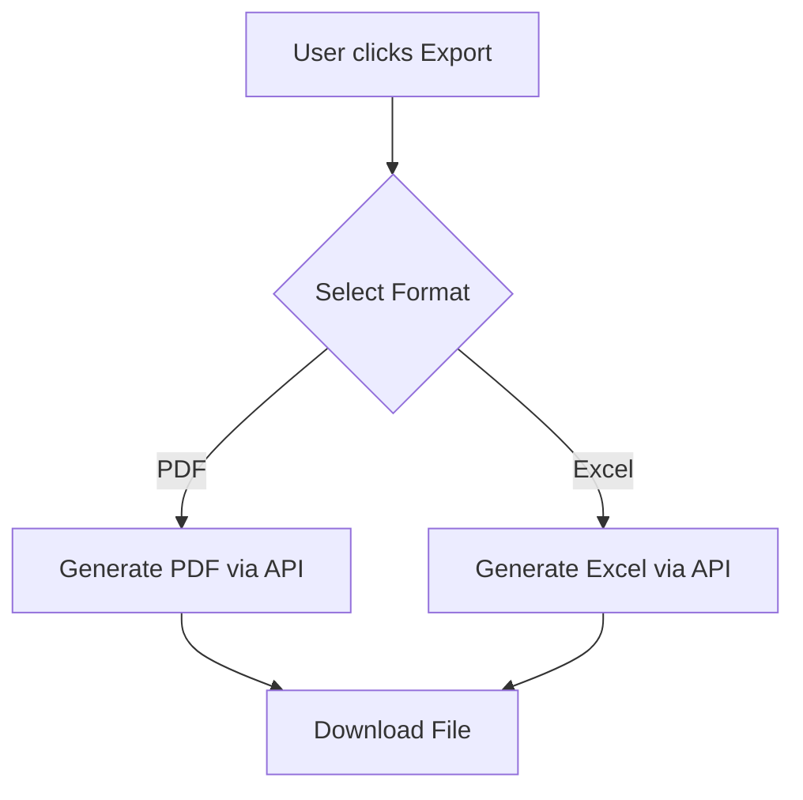
```mermaid
graph TD
    User[User clicks Export] --> Format{Select Format}
    Format -->|PDF| GenPDF[Generate PDF via API]
    Format -->|Excel| GenExcel[Generate Excel via API]
    GenPDF --> Download[Download File]
    GenExcel --> Download[Download File]
```

## Academic Year Administration Workflow
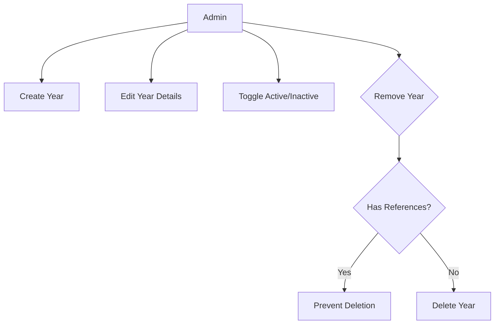
```mermaid
graph TD
    Admin[Admin] --> Create[Create Year]
    Admin --> Edit[Edit Year Details]
    Admin --> Toggle[Toggle Active/Inactive]
    Admin --> Remove{Remove Year}
    Remove --> CheckRef{Has References?}
    CheckRef -->|Yes| Block[Prevent Deletion]
    CheckRef -->|No| Delete[Delete Year]
```

## Deployment
Instructions for deploying the frontend and backend.

## Local Setup
1. Clone the repository.
2. Install backend dependencies `cd backend && npm install`.
3. Install frontend dependencies `cd frontend && npm install`.
4. Run backend `npm start` in the backend folder.
5. Run frontend `npm run dev` in the frontend folder.
